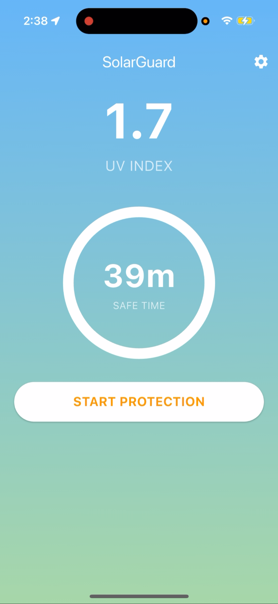
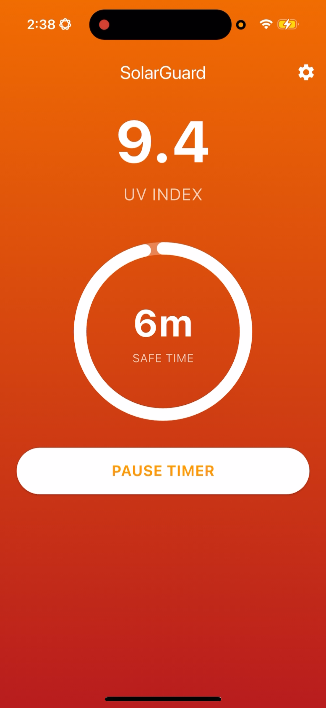
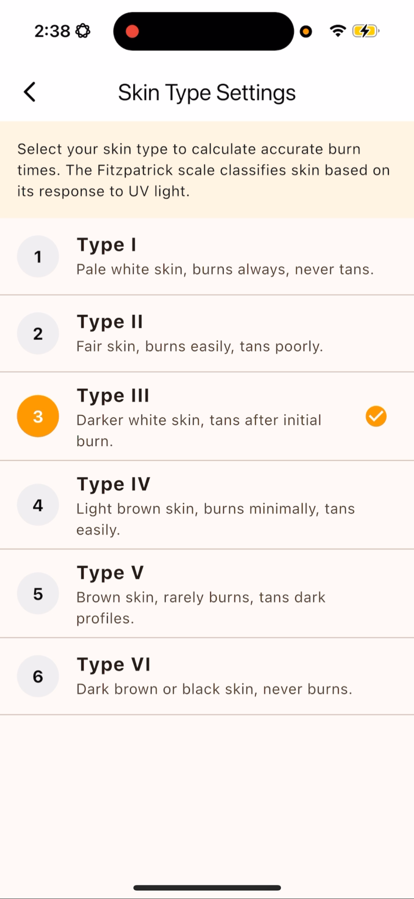

# ☀️ SolarGuard

**SolarGuard** is an intelligent solar safety companion designed to protect users from harmful UV radiation. By leveraging real-time GPS location and meteorological data, SolarGuard calculates the precise local UV Index and determines a personalized "Safe Burn Time" based on the user's specific Fitzpatrick skin type.

Whether you are at the beach or just walking to class, SolarGuard helps you enjoy the sun without the burn.

## 📱 Screenshots

| Home (Safe) | Home (Danger) | Settings |
|:---:|:---:|:---:|
|  |  |  |

> *Note: SolarGuard features a dynamic animated background that shifts from Calming Blue (Low UV) to Alert Red (Extreme UV) automatically.*

---

## 🛠 Architecture: MVVM

This project strictly follows the **Model-View-ViewModel (MVVM)** architectural pattern to separate business logic from UI code.

```text
lib/
├── main.dart
├── models/
│   └── weather_data.dart      <-- (Data Representation) Holds uvIndex from API
├── viewmodels/
│   └── sun_viewmodel.dart     <-- (Business Logic) Fetches GPS, calls API, calculates timer
├── services/
│   ├── location_service.dart  <-- (Hardware) Handles the "geolocator" package
│   └── api_service.dart       <-- (Data) Handles the HTTP calls to Open-Meteo
└── views/
    ├── home_screen.dart       <-- (UI) The screen showing the sun icon and timer
    ├── settings_screen.dart   <-- (UI) The skin type selector
    └── widgets/
        └── sun_ring.dart      <-- (UI) Reusable animated timer widget
```
### Components Breakdown
* **Models:** `WeatherData` - Immutable data class representing the API response.
* **ViewModels:** `SunViewModel` - The brain of the app. It handles:
    * Asynchronous API calls.
    * Timer logic and countdowns.
    * "Safe Burn Time" math based on skin type constants.
    * State management (Loading, Error, Success).
* **Views:** Declarative UI widgets that consume the ViewModel via `Provider`. They contain **no logic**, only UI code.

---

## 📡 APIs & Services
This app integrates with the following external data sources:

1.  **[Open-Meteo API](https://open-meteo.com/)**:
    * Used to fetch real-time `uv_index` data.
    * *Endpoint:* `https://api.open-meteo.com/v1/forecast`
2.  **Geolocator (Hardware)**:
    * Accesses the device's native GPS sensors to determine precise latitude/longitude.

---

## 🚀 Advanced Features
Per the course requirements for a team of 2 students, we implemented the following advanced features:

### 1. Animation
* **Daylight Gradient:** The app background uses an `AnimatedContainer` to interpolate colors (Blue $\to$ Orange $\to$ Red) based on live UV intensity.
* **Sun Ring:** A custom `TweenAnimationBuilder` visualizes the remaining safe time as a filling circular progress bar.

### 2. Gesture
* **Pull-to-Refresh:** Implemented a `RefreshIndicator` that triggers an asynchronous reload of GPS and Weather data when the user drags down on the screen.

---

## ⚙️ Build Instructions

To run this project locally, follow these steps:

**1. Prerequisites**
* Flutter SDK (3.9.x or higher)
* Dart SDK

**2. Clone & Install**
```bash
git clone https://github.com/MattBartie/UV_app.git
cd UV_app
flutter pub get
```

**3. Run**
```bash
flutter run
```
## 📦 Dependencies

### Runtime Dependencies
These packages are compiled into the final application code.

* **[flutter](https://flutter.dev/):** The framework used to build the app.
* **[cupertino_icons](https://pub.dev/packages/cupertino_icons):** Default icon set for iOS style icons.
* **[provider](https://pub.dev/packages/provider):** State management (MVVM architecture).
* **[http](https://pub.dev/packages/http):** Used to make asynchronous REST API calls to Open-Meteo.
* **[geolocator](https://pub.dev/packages/geolocator):** Accesses hardware GPS sensors for location data.
* **[shared_preferences](https://pub.dev/packages/shared_preferences):** For persisting user settings locally.

### Development Dependencies
These tools are used during the build and testing process but are not part of the final app bundle.

* **[flutter_test](https://flutter.dev/docs/testing):** The core testing framework for unit and widget tests.
* **[flutter_lints](https://pub.dev/packages/flutter_lints):** Enforces Dart coding standards and best practices.
* **[flutter_native_splash](https://pub.dev/packages/flutter_native_splash):** Generates the native launch screens (splash screens) for iOS and Android.
* **[flutter_launcher_icons](https://pub.dev/packages/flutter_launcher_icons):** Generates the native app icons for iOS and Android.

## 🤖 Generative AI Disclosure
This project utilized **Gemini 3 Pro** to assist with MVVM architectural planning, boilerplate code generation, and test creation. All AI-generated output was reviewed, verified, and debugged by the team to ensure correctness and performance.
